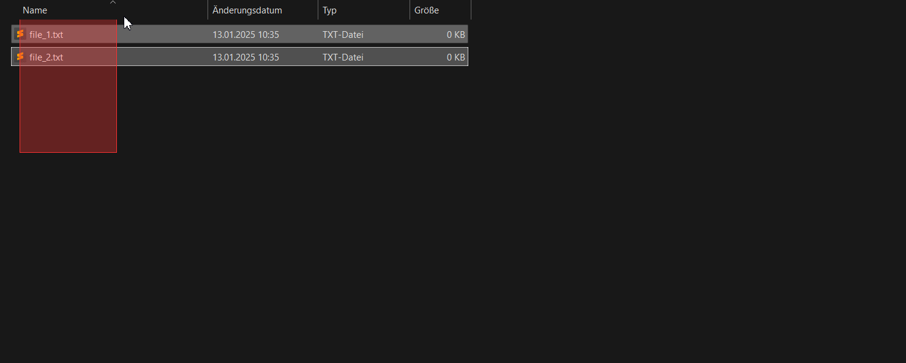

# Color Script

A batch script to change the Windows selection color (Mouse and Text selections) by modifying registry entries. The script allows you to customize the highlight colors used in Windows, providing a more personalized user experience.

## Features

- Change the highlight color for text and menu selections.
- Backup of current registry settings before making changes.
- Default color option if no input is provided.
- Option to restart the system immediately after changes.

## Previews

    

        <h3>Purple</h3>
        
    

    

        <h3>Green</h3>
        
    

    

        <h3>Red</h3>
        
    

## Prerequisites

- Windows operating system (specific versions may vary).
- Administrator privileges to modify registry entries.

## Usage

1. **Run the Script**: Execute the `change_color.bat` script.
2. **Enter Color Values**: You will be prompted to enter RGB values for the desired color.
   - **Red**: Enter a value between 0-255.
   - **Green**: Enter a value between 0-255.
   - **Blue**: Enter a value between 0-255.
3. **Default Color**: If no values are entered, the script defaults to a green color (RGB: 0, 215, 72).
4. **Backup**: A backup of the current color settings will be saved as `colors_backup.reg` in the current directory.
5. **Apply Changes**: The script updates the registry with the new color values.
6. **Restart Option**: You will be asked if you want to restart the system immediately to apply changes.

## Troubleshooting

- **Script Not Working**: Ensure you have the necessary permissions and are running the script as an administrator.
- **Color Not Changing**: Verify that the RGB values entered are correct and within the 0-255 range.

## Note

- **System Restart**: A system restart is required for the changes to take effect.
- **Backup**: Ensure the backup file is stored safely in case you need to revert changes. (If you lost the file, this is the default color: `0, 120, 215`)

## Known Issues

- When the user locks the screen, the color changes will reset to default.
- The script may not work on all versions of Windows.

## License

This project is licensed under the MIT License. See the [LICENSE](./LICENSE) file for details.

## Contributing

Contributions are welcome! Please feel free to submit a Pull Request.
